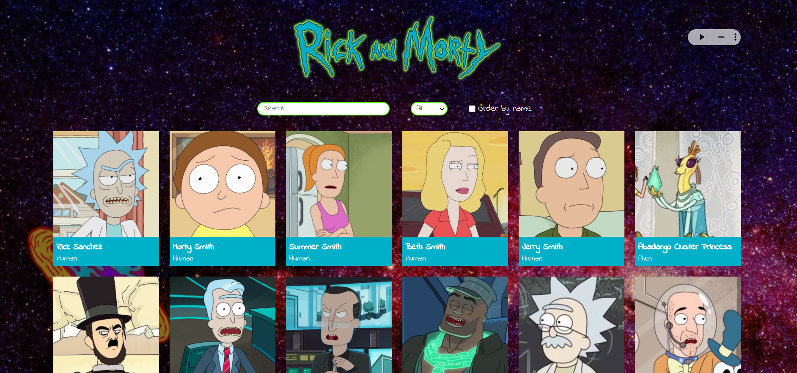
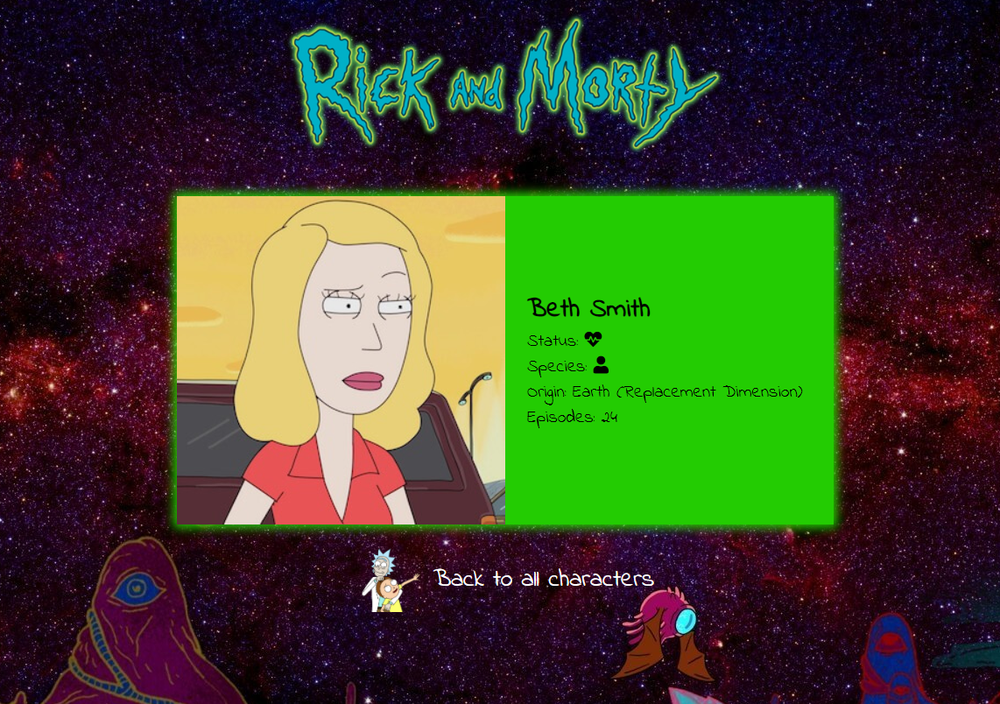

# Buscador de personajes de Rick and Morty

## Objetivo

Este es el ejercicio de la evaluación final del módulo 03 de Adalab. El ejercicio consiste en desarrollar una página web con un listado de personajes de Rick and Morty, pudiendo filtrar por el nombre del personaje y acceder a una ficha con los detalles de cada uno. Hemos usado el framework React para su realización.

## Desarrollo

#### 1. Pintar el listado de personajes haciendo una petición a una api:

En primer lugar, vamos a realizar una web con el listado de personajes de Rick and Morty. Para eso, vamos a utilizar el servicio de https://raw.githubusercontent.com/Adalab/rick-y-morty/master/data/rick-y-morty.json que nos devuelve información sobre los primeros 20 personajes de la serie. Sobre cada uno, vamos a pintar el nombre, la foto y la especie.

#### 2. Filtrar los personajes por nombre:

Ahora que ya tenemos el listado de personajes en pantalla, la segunda parte consiste en poder buscarlos por nombre. Para eso, añadimos un <input> a la interfaz, de forma que al ir escribiendo un nombre queden en la interfaz solo los personajes cuyo nombre contiene las letras escritas.

#### 3. Crear un detalle de cada tarjeta con React Router:

Vamos a implementar una nueva funcionalidad: al hacer clic sobre la tarjeta de un personaje, su información aparecerá a pantalla completa. Para hacer esto usaremos rutas y React router. En la pantalla de detalle aparecerá además de la foto, nombre y especie, el planeta de origen, el número de episodios en los que aparece y si está vivo o muerto.

#### 4. Bonus:

- Si estando en el campo de filtrado pulsamos intro debéis impedir que el navegador navegue o cambie la ruta sin querer.
  -Si se busca por un texto por ejemplo "XXX" y no hay ningún personaje que coincida con dicho texto se debe mostrar un mensaje del tipo "No hay ningún personaje que coincida con la palabra XXX".
- El filtro debe filtrar independientemente de que la usuaria introduzca el texto en mayúsuclas o minúsculas.
- Mostrar la especie y si un personajes está muerto con un icono.
- Que funcione bien el responsive en dispositivos pequeños.
- Ordenar el listado de personajes alfabéticamente por nombre.

## Previsualización aplicación

## Previsualización detalle tarjeta

